# Setup Guide

- **Create S3 bucket**

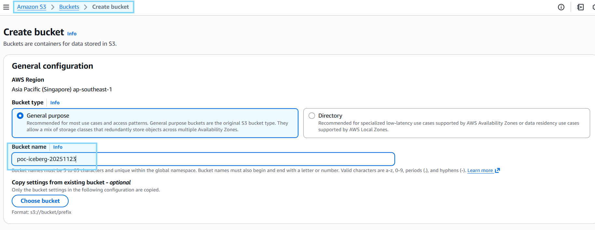

- **Create Glue database**

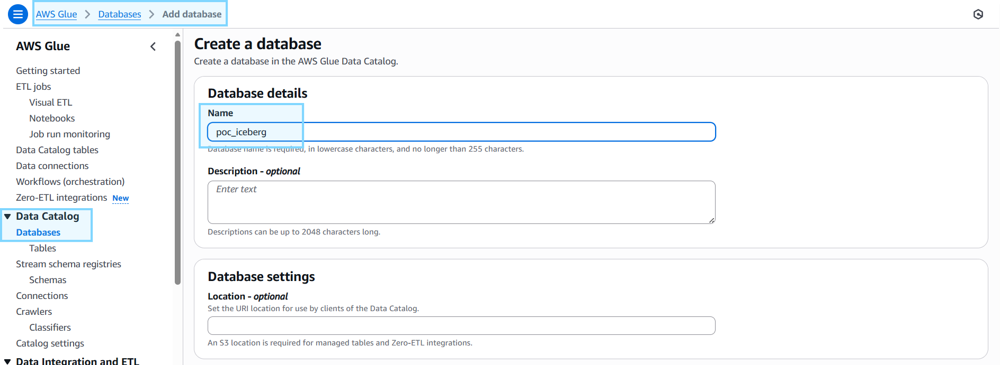

- **Create IAM role** with permission
    - `AmazonS3FullAccess`
    - `AWSGlueConsoleFullAccess`
    - `CloudWatchLogsFullAccess`
    - `AmazonKinesisAnalyticsFullAccess`

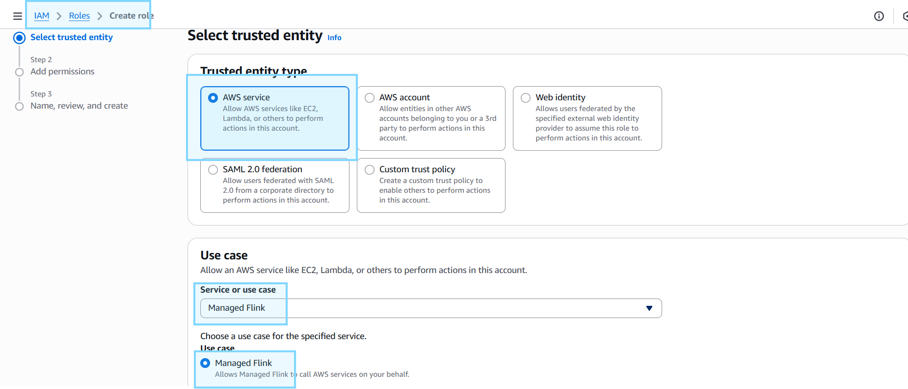

- **Install Maven**
```bash
apt install maven
```

### Flink jars file: -
- **Download via Maven**
```bash
./cli/build_flink_libs.sh
```
- **Upload to S3**

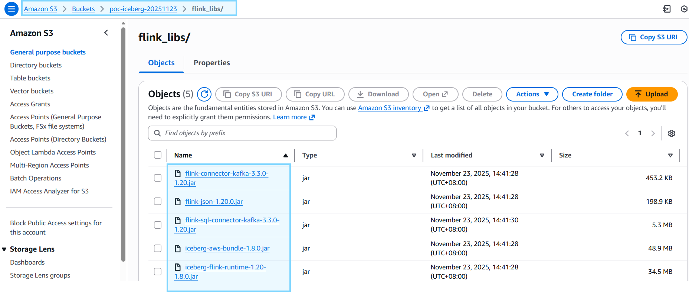

# Flink App
- **Create app script in `flink_app_example\src\main\java\com\example\DummyApp.java`**
- **Build app**
```bash
cd flink_app_example
mvn clean package -q
```
- **Upload to S3**

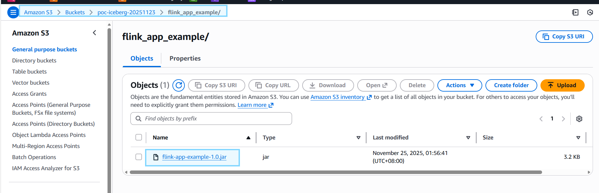

- **Create Flink App**

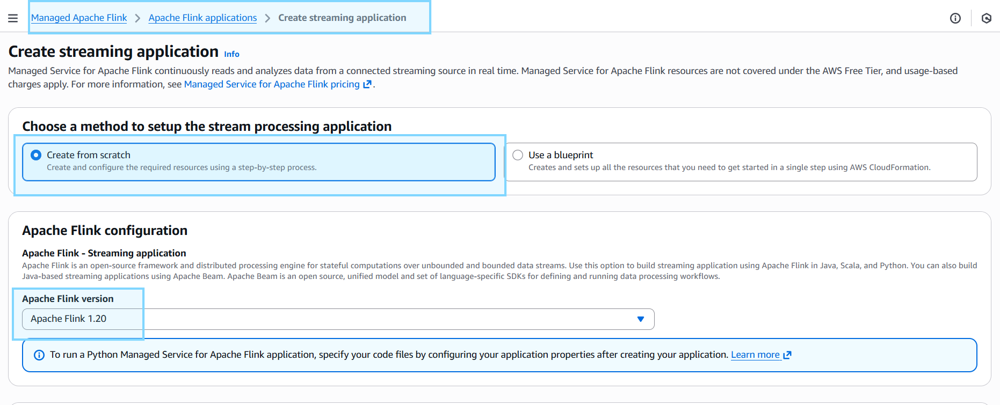
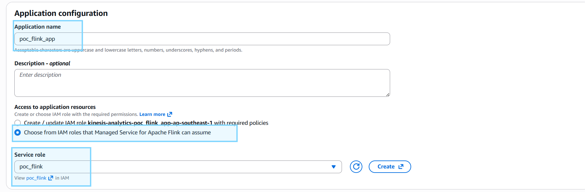

- **Set jars file** via `configure > runtime properties`
```bash
# Set Key = 
pipeline.classpaths

# Set Value =
s3://poc-iceberg-20251123/flink_libs/flink-connector-kafka-3.3.0-1.20.jar;s3://poc-iceberg-20251123/flink_libs/flink-sql-connector-kafka-3.3.0-1.20.jar;s3://poc-iceberg-20251123/flink_libs/flink-json-1.20.0.jar;s3://poc-iceberg-20251123/flink_libs/iceberg-flink-runtime-1.20-1.8.0.jar;s3://poc-iceberg-20251123/flink_libs/iceberg-aws-bundle-1.8.0.jar
```

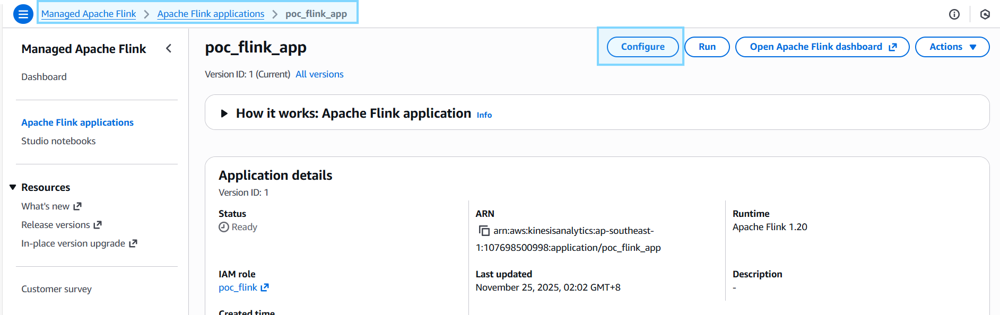
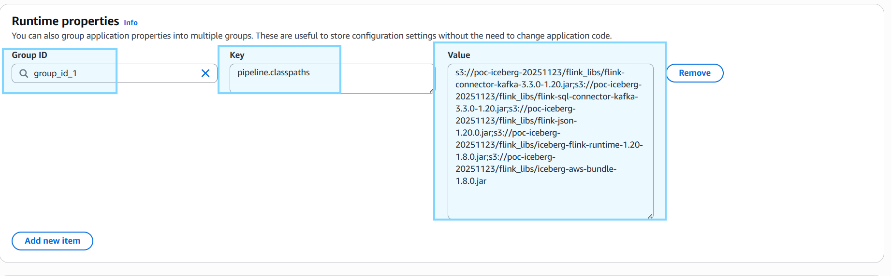

- **Set Application Code**

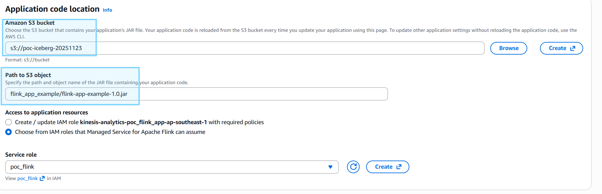

### Run Flink App: -

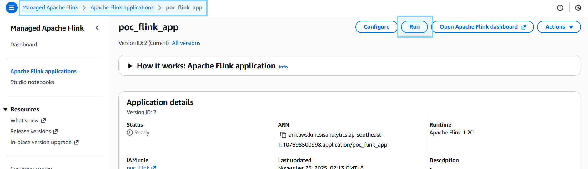

# Flink Notebook
- **Copy `.env.example` to `.env` & fill up values below**
```properties
# aws access key (optional)
AWS_ACCESS_KEY_ID=
AWS_SECRET_ACCESS_KEY=

# flink S3 bucket
S3_BUCKET_FLINK_LIBS=

# flink notebook
FLINK_NOTEBOOK=
```

### Flink jars file: -
- **Stop Flink Notebook app**

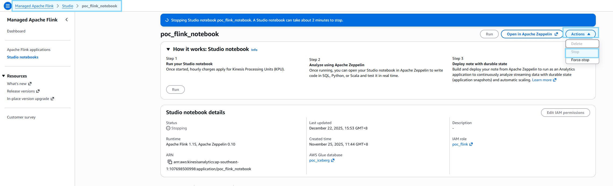

- **Download via Maven**
```bash
./cli/build_flink_libs.sh
```

- **Update Flink Notebook config**
```bash
./cli/update_flink_notebook.sh
```

- **Start Flink Notebook app**

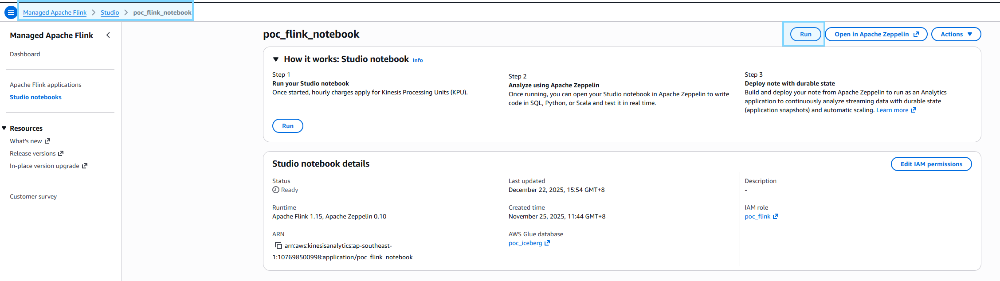
